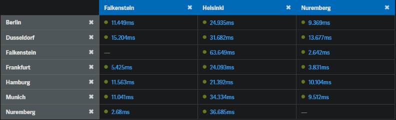
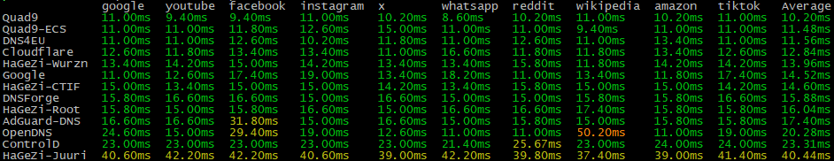

# HaGeZi DNS: Free, Non-Commercial EU Public DNS Servers

HaGeZi DNS offers free, non-commercial public DNS resolvers designed and operated by a private individual for the European community. It provides robust DNS-based blocking of ads, trackers, scam, phishing, fake, and malware domains, helping users achieve greater privacy and security online at zero cost.

> [!NOTE]
> This document covers technical setup and usage. For the full privacy policy, EU/Digital Services Act (DSA) compliance disclosure, and the glossary of legal terms, see [PRIVACY](PRIVACY.md).

## Table of Contents

- [Cheat Sheet (Quick Start)](CHEATSHEET.md)
  - [Pick a server by country and protection level](CHEATSHEET.md#pick-server)
  - [Connect (recommended: encrypted)](CHEATSHEET.md#connect)
  - [Platform setup (Apple, Android, Windows, router)](CHEATSHEET.md#platform-setup)
  - [Unencrypted fallback (Do53)](CHEATSHEET.md#do53-fallback)
  - [Verify it's working](CHEATSHEET.md#verify)
  - [Something not working?](CHEATSHEET.md#troubleshooting)
  - [Good to know](CHEATSHEET.md#things-to-know)
- [Features](#features)
  - [Security & Privacy](#security-privacy)
  - [Filtering/Blocking](#filtering)
    - [Block TTL and Response](#block-ttl)
    - [Special Domain Handling](#special-domains)
- [Logging and Data Handling](#logging)
  - [Server Health / Hourly Statistics](#server-health)
- [Server Locations & Access](#server-locations)
  - [Full Protection Servers](#full-servers)
  - [Threat-Only Servers](#threat-servers)
  - [DNS Stamps](#dns-stamps)
    - [Full Protection Servers](#dns-stamps-full)
    - [Threat-Only Servers](#dns-stamps-threat)
  - [Latency](#latency)
  - [Expected IP Addresses](#ip-addresses)
- [Web-Based DNS Testing Services](#testing-services)
- [Getting Help](#help)
- [Glossary](#glossary)
- [Legal & Privacy](#legal-privacy)

## Features <a id="features"></a>

- **EU-only hosting** (Hetzner: Falkenstein, Nuremberg, Helsinki) and jurisdiction, fully aligned with GDPR and [ENISA](PRIVACY.md#glossary) recommendations.
- **Fully open-source DNS infrastructure** combining Technitium DNS Server v15.4 with Unbound v1.26.0 as an upstream recursive resolver, featuring a local root zone for enhanced privacy, security, and performance.

### Security & Privacy <a id="security-privacy"></a>

- No recursion via third-party resolvers.
- Strict DNSSEC validation to prevent tampering.
- QNAME minimization enforced for better privacy.
- DNS leak/rebind protection.
- No EDNS Client Subnet: your location is never exposed to upstreams.
- ANY queries dropped to improve server performance and enhance privacy.
- Strict rate limiting for responses and clients.
- Encrypted transport: DNS-over-HTTPS/3 (DoH/DoH3), DNS-over-TLS (DoT), and DNS-over-QUIC (DoQ).
- EDE (Extended DNS Errors) support for more descriptive DNS errors.
- Hidden version and identity: CHAOS `version.bind` and `id.server` queries are refused for security hardening.
- Firewall restricted to ports strictly necessary for operation.
- Widely known internet scanners blocked at the firewall.
- Known malicious or abusive source IPs blocked at the firewall via locally maintained threat-intelligence blocklists (e.g., Spamhaus, AbuseIPDB), matched entirely on-server without transmitting any connection IP to these third parties.
- Source IPs observed directly attacking the service (e.g., flooding or attacking Do53) are blocked, independently of third-party lists.
- Tor exit nodes are blocked entirely due to persistent attack traffic observed from that network; DNS queries routed through Tor will not be answered.
- OS and DNS software regularly updated for the latest security patches.
- No logging or storage of individual queries per client.
- No query data shared with third parties: if nothing is logged, nothing can be handed over. The infrastructure providers required to run the service are disclosed in [PRIVACY](PRIVACY.md#disclaimer).

> [!NOTE]
> IP-based blocklists (used for firewall-level abuse prevention) may occasionally contain false positives. If you believe your IP is being blocked incorrectly, contact [support@hagezi.org](mailto:support@hagezi.org), or reach the operator privately via [Matrix](https://matrix.to/#/@hagezi:tchncs.de) or [Signal](https://signal.me/#eu/WlBfKuiT1S1GAGwDRpvIJErjM-C3IcjQUQ9HWLzeJKGKTfwlOGhEe7GQRSx05uX0). Please use one of these rather than the public support chat, since sorting out an IP block means sharing your IP address. See [PRIVACY](PRIVACY.md) for the legal basis of this processing.

### Filtering/Blocking <a id="filtering"></a>

HaGeZi DNS employs a balanced blocking strategy to deliver robust privacy and security while minimizing unnecessary restrictions. It offers effective protection without excessive blocking, making it ideal for most users. This balance is achieved with the following blocklists:

| Blocklist | Link | Blocks |
|---|---|---|
| HaGeZi Multi Pro | [Link](https://hagezi-mirror.dnsbunker.org/adblock/pro.txt) | Ads, tracking, analytics, metrics, telemetry |
| HaGeZi TIF (Threat Intelligence Feeds) | [Link](https://hagezi-mirror.dnsbunker.org/adblock/tif.txt) | Phishing, malware, scam, fake, cryptojacking |

Blocklists are regenerated every 4 hours and updated on the servers immediately afterward.

> [!IMPORTANT]
> No intentional censorship beyond privacy, ad, and security filtering. If a domain seems to be blocked incorrectly, or you believe a domain should be blocked, submit a report via the [blocklist repository's issue tracker](https://github.com/hagezi/dns-blocklists/issues) or contact [support@hagezi.org](mailto:support@hagezi.org). You can also use the official public [Matrix support chat](https://matrix.to/#/#hagezi-support:tchncs.de?via=tchncs.de). See [PRIVACY](PRIVACY.md) for the full content-moderation and DSA compliance disclosure.

> [!NOTE]
> A separate DNS server is available that uses only the HaGeZi TIF list, blocking exclusively phishing, malware, scam, fake, cryptojacking, and other harmful domains.

#### Block TTL and Response <a id="block-ttl"></a>

- **Block TTL: 3600 seconds (1 hour).** This reduces the frequency of repeated DNS requests for blocked domains, lowering CPU and network activity on mobile devices and helping save battery life. The value balances caching efficiency and responsiveness without sacrificing block update speed.
- **Block response: `0.0.0.0`.** Blocked domains resolve to `0.0.0.0` instead of `REFUSED`/`NXDOMAIN` or `127.0.0.1`, so connections fail immediately without local timeouts or retries in many apps, reducing unnecessary traffic.

#### Special Domain Handling <a id="special-domains"></a>

- **Mozilla Firefox canary domain** blocked, answered with `NXDOMAIN`: this signals to Firefox that the network already applies DNS filtering, so Firefox does not switch on its own DNS-over-HTTPS by itself and your queries keep reaching this resolver. It affects automatic activation only. If you have deliberately enabled DoH in Firefox's settings, that choice is respected and Firefox will keep using the provider configured there instead of this one.
- **Google Chrome preflight/prefetch domain** blocked, answered with `NXDOMAIN`: applies DNS filtering to resources preloaded via Chrome's private prefetch proxy.
- **Apple privacy features allowed:** domains required for iCloud Private Relay, Mail Privacy Protection, and Safari Tracking Prevention are explicitly permitted, so ad/tracker blocklists don't inadvertently break these Apple-provided privacy protections.

## Logging and Data Handling <a id="logging"></a>

- **Hourly statistics** (processed/blocked domain rankings, per-client query counts) are held only in RAM and auto-deleted every hour or on service/server restart. Query counts per client are used solely for rate limiting and are never linked to resolved or blocked domains. One deliberate exception applies: every 5 minutes, aggregate figures are read from these in-memory statistics and written to the static `stats.txt` file described [below](#server-health). That file contains totals and rankings only, with no client IP addresses and no per-client data, and it is overwritten on every update. No web server access logs are kept for it.
- **Error logging:** only domains that fail to resolve (e.g., DNSSEC validation failure, upstream/server error, timeout, resulting in `SERVFAIL`) are logged. Entries are retained for 24 hours for troubleshooting purposes on the legal basis of [Art. 6(1)(f) GDPR](PRIVACY.md#glossary) (legitimate interest in service reliability), and no client IP addresses are stored.
- **In-memory DNS cache** for enhanced privacy: no cache entry is ever written to disk, and all entries are automatically cleared on expiry or server restart.
- **Firewall-level IP blocking:** source IPs matched against local copies of third-party threat-intelligence blocklists, or observed directly attacking the service, are blocked at the firewall (nftables). This matching and blocking happens entirely on-server; no connection IP addresses are sent to the third parties whose lists are used. The great majority of block entries come from those third-party lists and are replaced with each refresh, so an address drops out as soon as the source list stops carrying it. The far smaller number of entries added manually after observed attacks persist until removed. No block entry is linked to any query data. See [PRIVACY](PRIVACY.md#disclaimer) for the legal basis and retention details, and [Security & Privacy](#security-privacy) above for how to report an incorrect block.

### Server Health / Hourly Statistics <a id="server-health"></a>

The following links provide server health status and a simplified overview of hourly statistics, including queries, blocked queries, clients, and other metrics. Each file is regenerated every 5 minutes from the server's in-memory statistics, so figures can be up to 5 minutes old:

[`root.hagezi.org`](https://root.hagezi.org/stats.txt) · [`wurzn.hagezi.org`](https://wurzn.hagezi.org/stats.txt) · [`juuri.hagezi.org`](https://juuri.hagezi.org/stats.txt) · [`ctif.hagezi.org`](https://ctif.hagezi.org/stats.txt)

## Server Locations & Access <a id="server-locations"></a>

Servers are accessible via encrypted DNS protocols, including DNS-over-HTTPS/3 (DoH/DoH3), DNS-over-TLS (DoT), and DNS-over-QUIC (DoQ), as well as unencrypted DNS over port 53 (Do53). Whenever possible, use DoH or DoH3.

> [!WARNING]
> Clients that use multiple encrypted DNS protocols simultaneously (e.g., DoH, DoT, and DoQ) against the same server may resolve the same domain in parallel multiple times, unnecessarily exhausting rate limits. There is no practical benefit to using all encrypted protocols at once; it only wastes resources.

> [!NOTE]
> Connections from Tor exit nodes are blocked on all servers and protocols, including Do53, due to persistent attack traffic observed from that network.

> [!NOTE]
> On the naming: the three full-protection servers are all called "root", once per location. `root` is English, `wurzn` is the Franconian dialect spoken around Nuremberg, and `juuri` is Finnish. `ctif` breaks the pattern and stands for Cyber Threat Intelligence Feed, after the list it runs on.

### Full Protection Servers (Ads, Tracking, and Threats) <a id="full-servers"></a>

These servers block ads, tracking, analytics, metrics, and telemetry in addition to phishing, malware, scam, fake, and cryptojacking domains.

| Location | Protocols | Endpoint/URL | Apple Config | Recommended for |
|---|---|---|---|---|
| Germany, Falkenstein | DoH/DoH3 | `https://root.hagezi.org/dns-query` | [Link](mobileconfig/root-hagezi-org.mobileconfig) · [QR](mobileconfig/root-hagezi-org.mobileconfig.png) | AT, BA, BE, BG, CH, CZ, DE, DK, FR, GB, HU, IE, IT, LU, NL, PL, RO, SI, SK |
| | DoT/DoQ | `root.hagezi.org` | | |
| | Do53 | `188.34.161.210`<br>`2a01:4f8:c17:1c66::1` | | |
| Germany, Nuremberg | DoH/DoH3 | `https://wurzn.hagezi.org/dns-query` | [Link](mobileconfig/wurzn-hagezi-org.mobileconfig) · [QR](mobileconfig/wurzn-hagezi-org.mobileconfig.png) | AT, BA, BE, BG, CH, CZ, DE, DK, ES, FR, GB, GR, HR, HU, IE, IT, LU, MD, MK, MT, NL, PL, PT, RO, RS, SI, SK, TR, UA |
| | DoT/DoQ | `wurzn.hagezi.org` | | |
| | Do53 | `159.69.155.94`<br>`2a01:4f8:1c1c:d363::1` | | |
| Finland, Helsinki | DoH/DoH3 | `https://juuri.hagezi.org/dns-query` | [Link](mobileconfig/juuri-hagezi-org.mobileconfig) · [QR](mobileconfig/juuri-hagezi-org.mobileconfig.png) | DK, EE, FI, LT, LV, NO, SE |
| | DoT/DoQ | `juuri.hagezi.org` | | |
| | Do53 | `95.217.163.17`<br>`2a01:4f9:c013:dc4e::1` | | |

### Threat-Only Servers (Security Filtering Only) <a id="threat-servers"></a>

This server blocks only phishing, malware, scam, fake, cryptojacking, and other harmful domains, without ad or tracker blocking.

| Location | Protocols | Endpoint/URL | Apple Config | Recommended for |
|---|---|---|---|---|
| Germany, Nuremberg | DoH/DoH3 | `https://ctif.hagezi.org/dns-query` | [Link](mobileconfig/ctif-hagezi-org.mobileconfig) · [QR](mobileconfig/ctif-hagezi-org.mobileconfig.png) | AT, BA, BE, BG, CH, CZ, DE, DK, ES, FR, GB, GR, HR, HU, IE, IT, LU, MD, MK, MT, NL, PL, PT, RO, RS, SI, SK, TR, UA |
| | DoT/DoQ | `ctif.hagezi.org` | | |
| | Do53 | `162.55.58.40`<br>`2a01:4f8:1c19:6c19::1` | | |

EU and neighboring countries with limited coverage from current server locations: AD, CY, GE, IS, LI, MC, ME, SM.

### DNS Stamps <a id="dns-stamps"></a>

> [!NOTE]
> Encrypted DNS Stamps let compatible tools connect to HaGeZi DNS automatically, with all needed connection details built in.

#### Full Protection Servers <a id="dns-stamps-full"></a>

| Endpoint | Protocol : DNS Stamp |
|---|---|
| `root.hagezi.org` | DoH: `sdns://AgMAAAAAAAAADjE4OC4zNC4xNjEuMjEwAA9yb290LmhhZ2V6aS5vcmcKL2Rucy1xdWVyeQ` |
| | DoT: `sdns://AwMAAAAAAAAADjE4OC4zNC4xNjEuMjEwAA9yb290LmhhZ2V6aS5vcmc` |
| | DoQ: `sdns://BAMAAAAAAAAADjE4OC4zNC4xNjEuMjEwAA9yb290LmhhZ2V6aS5vcmc` |
| `wurzn.hagezi.org` | DoH: `sdns://AgMAAAAAAAAADTE1OS42OS4xNTUuOTQAEHd1cnpuLmhhZ2V6aS5vcmcKL2Rucy1xdWVyeQ` |
| | DoT: `sdns://AwMAAAAAAAAADTE1OS42OS4xNTUuOTQAEHd1cnpuLmhhZ2V6aS5vcmc` |
| | DoQ: `sdns://BAMAAAAAAAAADTE1OS42OS4xNTUuOTQAEHd1cnpuLmhhZ2V6aS5vcmc` |
| `juuri.hagezi.org` | DoH: `sdns://AgMAAAAAAAAADTk1LjIxNy4xNjMuMTcAEGp1dXJpLmhhZ2V6aS5vcmcKL2Rucy1xdWVyeQ` |
| | DoT: `sdns://AwMAAAAAAAAADTk1LjIxNy4xNjMuMTcAEGp1dXJpLmhhZ2V6aS5vcmc` |
| | DoQ: `sdns://BAMAAAAAAAAADTk1LjIxNy4xNjMuMTcAEGp1dXJpLmhhZ2V6aS5vcmc` |

#### Threat-Only Servers <a id="dns-stamps-threat"></a>

| Endpoint | Protocol : DNS Stamp |
|---|---|
| `ctif.hagezi.org` | DoH: `sdns://AgMAAAAAAAAADDE2Mi41NS41OC40MAAPY3RpZi5oYWdlemkub3JnCi9kbnMtcXVlcnk` |
| | DoT: `sdns://AwMAAAAAAAAADDE2Mi41NS41OC40MAAPY3RpZi5oYWdlemkub3Jn` |
| | DoQ: `sdns://BAMAAAAAAAAADDE2Mi41NS41OC40MAAPY3RpZi5oYWdlemkub3Jn` |

### Latency <a id="latency"></a>

> [!TIP]
> For a general idea of the latency between your location and our server locations, use [WonderNetwork's Global Ping Statistics](https://wondernetwork.com/pings).

Example WonderNetwork compilation configured for Germany:



To optimize latency, personally measure the response times by pinging each DNS server from your own connection. This factors in your specific network conditions, such as geographic location, ISP routing, and local congestion, giving you a practical, real-world latency measurement. Selecting the server with the lowest ping time maximizes responsiveness and reduces DNS query delays.

Use the provided test scripts to measure actual DNS resolution times (beyond simple ICMP latency), evaluating how quickly each server resolves domain queries in practice:

- [dnsperftest.sh](scripts/dnsperftest.sh) (Unix/Linux shell script)
- [dnsperftest.ps1](scripts/dnsperftest.ps1) (PowerShell script)

```
./dnsperftest.sh
```



[Latency cheat sheet (PDF)](docs/latency.pdf): summarizes measured network latency in milliseconds from six European PoPs (Amsterdam, Falkenstein, Frankfurt, Helsinki, Nürnberg, Vienna) to cities across European countries, highlighting the fastest location per city and EU membership status, based on WonderNetwork ping data.

**DNS resolution reference values (ms):**

| DNS resolve/lookup time (ms) | Rating | What it usually means |
|---:|---|---|
| < 20 | Excellent | Very fast response, often due to a nearby resolver and/or a warm cache. |
| 20-50 | Very good | Common target range for good user experience. |
| 50-100 | OK | Usually fine, but can add noticeable delay if a page triggers many lookups. |
| 100-120 | Average | Often cited as the upper end of "average" DNS lookup time. |
| 120-200 | Slow | Suggests distance, routing/latency, resolver load, or extra resolution steps. |
| > 200 | Very slow / problematic | Frequently indicates a real performance or reachability issue (retries, timeouts, overload). |

### Expected IP Addresses <a id="ip-addresses"></a>

- `188.34.161.210` / `2a01:4f8:c17:1c66::1` (PTR: `root.hagezi.org`), Hetzner Online GmbH, Falkenstein, Saxony, DE
- `159.69.155.94` / `2a01:4f8:1c1c:d363::1` (PTR: `wurzn.hagezi.org`), Hetzner Online GmbH, Nürnberg, Bavaria, DE
- `95.217.163.17` / `2a01:4f9:c013:dc4e::1` (PTR: `juuri.hagezi.org`), Hetzner Online GmbH/HOS-GUN, Helsinki, Uusimaa, FI
- `162.55.58.40` / `2a01:4f8:1c19:6c19::1` (PTR: `ctif.hagezi.org`), Hetzner Online GmbH, Nürnberg, Bavaria, DE

If a [DNS leak test](https://dnscheck.tools) shows IP addresses other than these, your device or network might be leaking DNS queries through fallback resolvers or directly to your ISP. This means requests are bypassing your intended DNS protection and potentially exposing your browsing activity.

## Web-Based DNS Testing Services <a id="testing-services"></a>

- **DNS Leak Test:** [dnscheck.tools](https://dnscheck.tools) · [dnsleaktest.com](https://www.dnsleaktest.com/) · [browserleaks.com](https://browserleaks.com/dns)
- **DNS Nameserver Spoofability Test:** [GRC](https://www.grc.com/dns/dns.htm)
- **DNS Rebind Test:** [ControlD](https://controld.com/tools/dns-rebind-test)
- **Domain Lookup Service:** [DNSclient](https://dnsclient.net)
- **DNS Zone/DNSSEC Status:** [DNSViz](https://dnsviz.net/)

## Getting Help <a id="help"></a>

Contact [support@hagezi.org](mailto:support@hagezi.org) for support and questions. You can also use the official public [Matrix support chat](https://matrix.to/#/#hagezi-support:tchncs.de?via=tchncs.de), or contact the operator directly via [Matrix](https://matrix.to/#/@hagezi:tchncs.de) or [Signal](https://signal.me/#eu/WlBfKuiT1S1GAGwDRpvIJErjM-C3IcjQUQ9HWLzeJKGKTfwlOGhEe7GQRSx05uX0).

## Glossary <a id="glossary"></a>

- **ANY query:** a DNS query type that historically requested all available records for a domain at once; now commonly blocked by resolvers because it is rarely used legitimately and is often abused for denial-of-service amplification.
- **Canary domain:** a domain name a browser or operating system looks up to check whether the local network already applies DNS filtering; an `NXDOMAIN` answer signals that it does, so the client does not switch on its own DNS provider automatically.
- **CHAOS query:** a special DNS query class (distinct from normal domain lookups) used to request server metadata such as `version.bind` or `id.server`; disabling it prevents attackers from identifying the server software or instance.
- **DNS Stamp:** a compact, encoded string (starting with `sdns://`) that bundles a DNS server's address, protocol, and public key information so compatible client software can configure a connection automatically.
- **DNSSEC (DNS Security Extensions):** a set of cryptographic signatures added to DNS responses that let a resolver verify a response has not been tampered with in transit.
- **Do53:** traditional, unencrypted DNS carried over port 53; visible to anyone who can observe network traffic.
- **DoH / DoH3 (DNS-over-HTTPS):** DNS queries and responses carried inside an encrypted HTTPS connection (DoH3 uses HTTP/3), hiding DNS traffic from network observers.
- **DoQ (DNS-over-QUIC):** DNS carried over the QUIC transport protocol, combining encryption with QUIC's faster connection setup.
- **DoT (DNS-over-TLS):** DNS queries and responses carried inside a dedicated, encrypted TLS connection on a separate port.
- **EDE (Extended DNS Errors):** a mechanism that adds a specific, human-readable reason code to a DNS error response instead of a generic failure.
- **EDNS Client Subnet (ECS):** an optional DNS extension that would normally forward part of a client's IP address to upstream servers to improve geographic accuracy; disabling it keeps the client's location hidden from upstream resolvers.
- **HTTPS / SVCB records:** newer DNS record types that let a domain publish connection parameters, such as the protocols it supports and its ECH configuration, alongside its address, so a client can establish the connection correctly on the first attempt.
- **ICMP (Internet Control Message Protocol):** the protocol used by tools like `ping` to measure basic network round-trip time; it measures raw network latency only, not actual DNS query resolution time.
- **nftables:** the modern Linux kernel firewall framework used on the servers to enforce IP-level blocking and rate limiting.
- **NXDOMAIN:** a DNS response code meaning the requested domain does not exist.
- **PTR record:** a reverse DNS record that maps an IP address back to a hostname.
- **QNAME minimization:** a privacy technique where a resolver only sends the minimum portion of a domain name necessary to each server in the resolution chain, rather than the full domain name.
- **Recursive resolver:** a DNS server that performs the full lookup process on behalf of a client, querying other servers as needed, rather than simply forwarding the request elsewhere.
- **REFUSED:** a DNS response code indicating the server declined to answer the query, distinct from `NXDOMAIN` (domain does not exist) and `SERVFAIL` (resolution error).
- **Root zone:** the top level of the DNS hierarchy; running a local copy allows a resolver to look up top-level domains directly instead of depending on external root servers.
- **SERVFAIL:** a DNS response code indicating the server encountered an error while trying to resolve the query (for example, a DNSSEC validation failure).
- **Technitium DNS Server:** the open-source DNS server software used to run the public-facing resolver component of this service.
- **Tor exit node:** the final relay in the Tor anonymity network through which traffic exits onto the public internet; frequently associated with automated abuse due to its anonymizing nature.
- **TTL (Time to Live):** the number of seconds a DNS response may be cached before it must be looked up again.
- **Unbound:** an open-source, validating, recursive DNS resolver used as the upstream resolution engine behind Technitium DNS Server in this setup.

> [!NOTE]
> Legal and regulatory terms (GDPR, DSA, ENISA, and related concepts) are defined in the [Glossary in PRIVACY](PRIVACY.md#glossary).

## Legal & Privacy <a id="legal-privacy"></a>

This document covers technical setup and usage only. The full disclaimer, EU privacy policy, Digital Services Act (DSA) content-moderation compliance information, and a glossary of legal terms are maintained in a separate document: [PRIVACY](PRIVACY.md).
